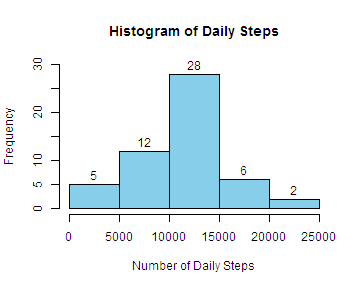
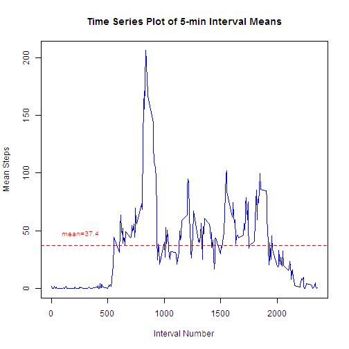
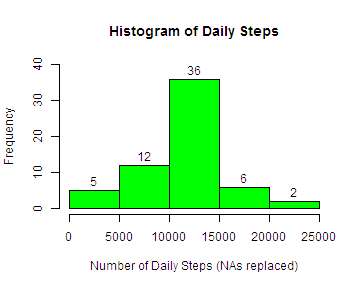
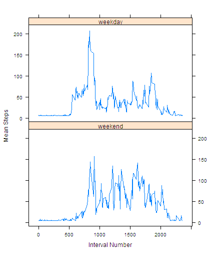

Start the timer to monitor procesing time.


```r
start <- proc.time()
```

### Introduction

This analysis uses the [activity monitoring](https://d396qusza40orc.cloudfront.net/repdata%2Fdata%2Factivity.zip) dataset for analysis of the steps measurements taken over a 61-day period. The steps were measured at 5-minute intervals.


Load the packages that will be used in this analysis.


```r
suppressWarnings(suppressMessages(library(dplyr))) 
suppressWarnings(suppressMessages(library(lubridate)))
suppressWarnings(suppressMessages(library(lattice)))
```

Read the dataset into the variable *activity* and check its structure:


```r
activity <- read.csv("activity.csv")
str(activity)
```

```
## 'data.frame':	17568 obs. of  3 variables:
##  $ steps   : int  NA NA NA NA NA NA NA NA NA NA ...
##  $ date    : Factor w/ 61 levels "2012-10-01","2012-10-02",..: 1 1 1 1 1 1 1 1 1 1 ...
##  $ interval: int  0 5 10 15 20 25 30 35 40 45 ...
```

Change the date to date format.


```r
activity$date <- ymd(as.character(activity$date))
```

Check a few rows of the dataset.


```r
head(activity)
```

```
##   steps       date interval
## 1    NA 2012-10-01        0
## 2    NA 2012-10-01        5
## 3    NA 2012-10-01       10
## 4    NA 2012-10-01       15
## 5    NA 2012-10-01       20
## 6    NA 2012-10-01       25
```

Find the dimensions and unique dates for the dataset.


```r
dim(activity)
```

```
## [1] 17568     3
```

```r
uDates <- unique(activity$date)
length(uDates)
```

```
## [1] 61
```

### Part I

Create a subset *activityf* with NAs filtered out.


```r
activityf <- filter(activity, steps>=0)   #remove NAs
```

Find the number of steps taken daily.


```r
bydate <- group_by(tbl_df(activityf), date)
daily <- summarise(bydate, Steps=sum(steps))
dim(daily)
```

```
## [1] 53  2
```

Note the histogram below has 53 days excluding the 8 days where all steps were NAs:


```r
hist(daily$Steps, 
     xlab   = "Number of Daily Steps", 
     main   = "Histogram of Daily Steps", 
     ylim   = c(0, 30), col="skyblue", 
     labels = TRUE)
```

 

Find the mean and median of the number of daily steps:


```r
mean(daily$Steps)
```

```
## [1] 10766.19
```

```r
median(daily$Steps)
```

```
## [1] 10765
```

For the time-series plot, this was assumed to require an average of each 5-min interval across all days:


```r
byinterval <- group_by(tbl_df(activityf), interval)
fiveMin <- summarise(byinterval, Steps=sum(steps), count=n())
fiveMin <- mutate(fiveMin, meanSteps=Steps/count)

plot(fiveMin$interval, fiveMin$meanSteps, 
     main="Time Series Plot of 5-min Interval Means",
     xlab="Interval Number",  
     ylab="Mean Steps",
     col="blue",
     type="l")

abline(h=mean(fiveMin$meanSteps), lty=2, lwd=1.5, col="red")  #show the mean of interval means
text(260, 48, "mean=37.4", cex=0.8, col="red")
```

 

Find which interval contains the maximum steps.


```r
maxinterval <- fiveMin[which(fiveMin$meanSteps==max(fiveMin$meanSteps)),]
maxinterval
```

```
## Source: local data frame [1 x 4]
## 
##   interval Steps count meanSteps
## 1      835 10927    53  206.1698
```

The interval number 835 has the maximum mean steps of 206.17.


### Part II

Find the number of rows with steps showing NAs in the *activity* dataset.


```r
nulls <- is.na(activity$steps)    #This is the logical vector showing TRUE for NA and FALSE otherwise
```

Find the number of NAs. 


```r
length(nulls[nulls==TRUE])       #This provides the number of NAs
```

```
## [1] 2304
```

Create a new dataset *activityNew* that replaces the NAs. Replace the NAs by the 5-min average based on the mean od the daily steps excluding NAs, i.e. 10766.19 shown earlier. Convert this to a 5-min value. There are 24 hr x 12 5-min intervals/hr = 288 5-min intervals per day. So there are 10766.19/288 = 37.3826 average steps in each 5-min interval. Replace the 2304 NAs with this average value.


```r
activityNew <- activity
activityNew$steps[nulls] <- mean(daily$Steps)/288
activityNew$date <- ymd(as.character(activityNew$date))  # change to date format
dim(activityNew)        # check dimensions to ensure full dataset
```

```
## [1] 17568     3
```

```r
head(activityNew)       # check a few rows
```

```
##     steps       date interval
## 1 37.3826 2012-10-01        0
## 2 37.3826 2012-10-01        5
## 3 37.3826 2012-10-01       10
## 4 37.3826 2012-10-01       15
## 5 37.3826 2012-10-01       20
## 6 37.3826 2012-10-01       25
```

Find the number of steps taken daily.


```r
bydate <- group_by(tbl_df(activityNew), date)
daily <- summarise(bydate, Steps=sum(steps))
dim(daily)
```

```
## [1] 61  2
```

Note the histogram below has 61 days including the 8 days where all steps with NAs were replaced with the mean value of all intervals:


```r
hist(daily$Steps, 
     xlab   = "Number of Daily Steps (NAs replaced)", 
     main   = "Histogram of Daily Steps", 
     ylim   = c(0, 40), col="green", 
     labels = TRUE)
```

 

Display the mean and the median of the daily steps in the *activityNew* dataset.


```r
mean(daily$Steps)
```

```
## [1] 10766.19
```

```r
median(daily$Steps)
```

```
## [1] 10766.19
```

Note that the mean is identical to the mean of the original dataset mainly because of the strategy used to replace the NAs. This need not be true if a different method had been used to replace the NAs. The median changed slightly, from 10765 to 10766.19. 

Next, create a variable with two levels - weekday and weekend in the dataset *activityNew*.


```r
for (i in 1:nrow(activityNew)) 
{
if (weekdays(activityNew$date[i]) == "Saturday" | weekdays(activityNew$date[i]) == "Sunday") 
     {activityNew$day[i] <- "weekend"}
else {activityNew$day[i] <- "weekday"}
}
activityNew$day <- as.factor(activityNew$day)
str(activityNew)
```

```
## 'data.frame':	17568 obs. of  4 variables:
##  $ steps   : num  37.4 37.4 37.4 37.4 37.4 ...
##  $ date    : POSIXct, format: "2012-10-01" "2012-10-01" ...
##  $ interval: int  0 5 10 15 20 25 30 35 40 45 ...
##  $ day     : Factor w/ 2 levels "weekday","weekend": 1 1 1 1 1 1 1 1 1 1 ...
```

Summarize the steps by interval and day type, and plot the results


```r
bydayinterval <- group_by(tbl_df(activityNew), day, interval)
fiveMin <- summarise(bydayinterval, Steps=sum(steps), count=n())
fiveMin <- mutate(fiveMin, meanSteps=Steps/count)

xyplot(meanSteps ~ interval | day, data=fiveMin, 
       type   = "l",
       as.table = TRUE,
       xlab   = "Interval Number",
       ylab   = "Mean Steps")
```

 

Beyond this point, not asked for but compare the means for weekdays and weekends - they appear to be different


```r
gp1 <- group_by(fiveMin, day)
summarise(gp1, meanSteps=mean(meanSteps))
```

```
## Source: local data frame [2 x 2]
## 
##       day meanSteps
## 1 weekday  35.61058
## 2 weekend  42.36640
```
Run the *t.test* to determine if the means are significantly different.


```r
wk <- filter(fiveMin, day=="weekday")
we <- filter(fiveMin, day=="weekend")
t.test(wk$meanSteps, we$meanSteps, paired=FALSE)
```

```
## 
## 	Welch Two Sample t-test
## 
## data:  wk$meanSteps and we$meanSteps
## t = -2.147, df = 571.964, p-value = 0.03221
## alternative hypothesis: true difference in means is not equal to 0
## 95 percent confidence interval:
##  -12.936075  -0.575565
## sample estimates:
## mean of x mean of y 
##  35.61058  42.36640
```
Yes, the means are higher during weekends as might be expected (*p-value < 0.05*)!

Check the timer.


```r
time <- proc.time() - start
time
```

```
##    user  system elapsed 
##   11.33    0.11   11.47
```
